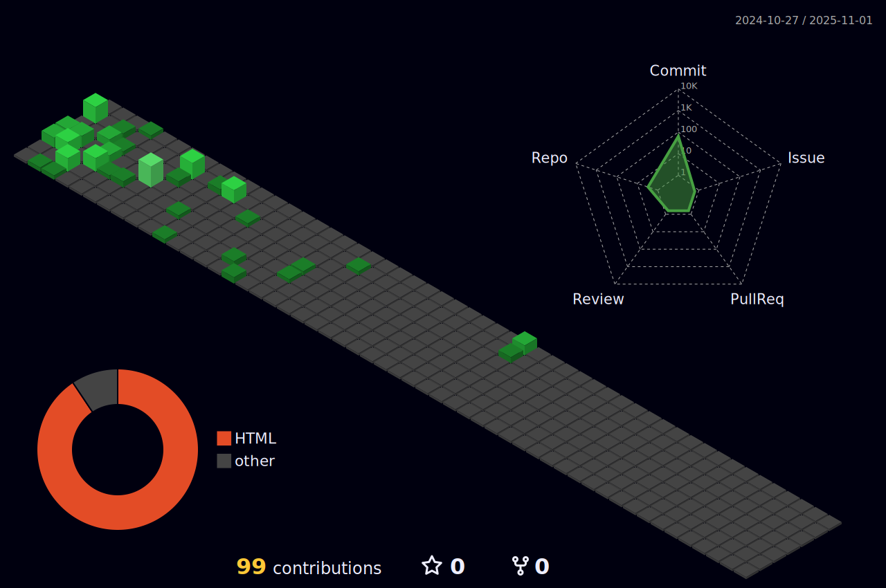

<h1 align="center">Hi!👋My name is Ronald Sancho</h1>

<h3 align="cemter">I am a systems engineering student</h3>

I am a recent graduate from Fidelitas University in Computer Systems Engineering. Both in the career and self-taught I have learned languages for FrontEnd and BanckEnd so I develop myself well as Full Stack Developer. I like to be constantly learning new technologies, creating solutions to current problems and listening to music.

* 🌍  I'm based in Costa Rica
* 🖥️  See my portfolio at [Ronald Portfolio](http://ronaldsancho.github.io/Portfolio_Ronald/)
* ✉️  You can contact me at [ronalsancho@gmail.com](mailto:ronalsancho@gmail.com)
* 🧠  I'm learning new languages, frameworks and technologies
* ⚡  I'm doing some of these activities I also like to listen to music.

<h3 align="left">Skills</h3>

    <table>
        <tr>
            <td valign="top" width="33%">
                <h3 align="center">Programming Languages</h3>
                
 
                    
                    
                    
                    
                    
                

            </td>
            <td valign="top" width="33%">
                <h3 align="center">Frontend Development</h3>
                
 
                    
                    
                    
                    
                    
                

            </td>
            <td valign="top" width="33%">
                <h3 align="center">Backend Development</h3>
                

                    
                    
                    
                

            </td>
        </tr>
            <tr>
            <td valign="middle" width="33%">
                <h3 align="center">Database</h3>
                

                    
                    
                    
                    
                    
                

            </td>
            <td valign="top" width="33%">
                <h3 align="center">Software</h3>
                
 
                    
                    
                    
                

            </td>
            <td valign="top" width="33%">
                <h3 align="center">Others</h3>
                

                    
                    
                    
                

            </td>
        </tr>
    </table>

### Socials

<b>My GitHub Stats</b>

