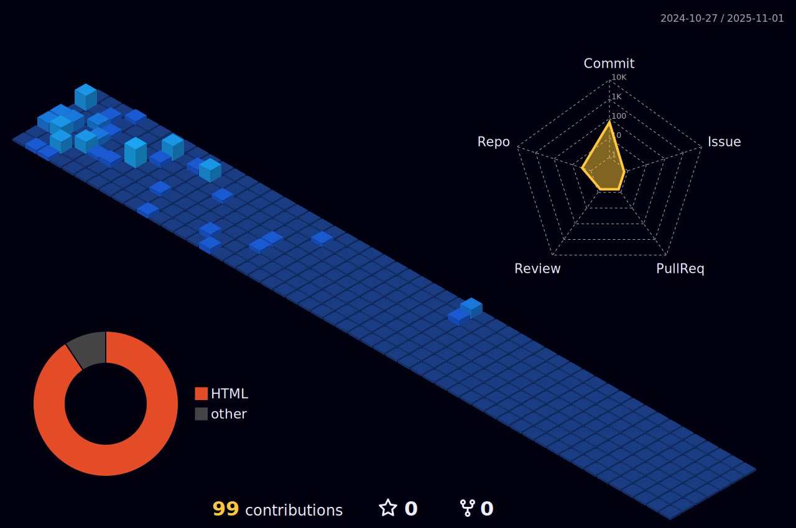

# Hi My name is Ronald Sancho Díaz

## I am a systems engineering student.

I am currently finishing my degree in computer systems engineering. Both in the career and self-taught I have learned languages for FrontEnd and BanckEnd so I develop myself well as Full Stack Developer. I like to be constantly learning new technologies, creating solutions to current problems and listening to music.

* 🌍  I'm based in Costa Rica
* 🖥️  See my portfolio at [Ronald Portfolio](http://ronaldsancho.github.io/Portfolio_Ronald/)
* ✉️  You can contact me at [ronalsancho@gmail.com](mailto:ronalsancho@gmail.com)
* 🧠  I'm learning new languages, frameworks and technologies
* ⚡  I'm doing some of these activities I also like to listen to music.

    <table>
        <tr>
            <td valign="middle" width="33%">
                <h3 align="center">Programming Languages</h3>
                

                     
                     
                     
                    
                    
                    
                    
                    
                

            </td>
            <td valign="top" width="33%">
                <h3 align="center">Frontend Development</h3>
                
 
                     
                     
                    <a href="https://reactjs.org/" > 
                         
                     
                    
                     
                

                <h3 align="center">Other</h3>
                

                     
                    
                    
                    
                

            </td>
            <td valign="top" width="33%">
                <h3 align="center">Backend Development</h3>
                

                     
                    
                    
                    
                

                <h3 align="center">Database & Testing</h3>
                
 
                    
                    
                    
                     
                     
                

            </td>
                        <td valign="middle" width="33%">
                <h3 align="center">Programming Languages</h3>
                

                     
                     
                     
                    
                    
                    
                    
                    
                

            </td>
        </tr>
    </table>

### Socials

 

<b>My GitHub Stats</b>

